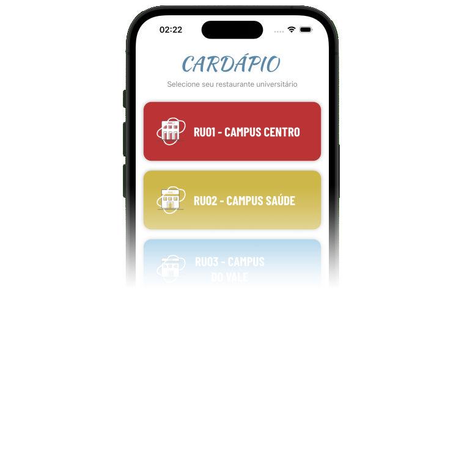

# 🍽️ HojeNoRU iOS 📱
Frontend iOS para a HojeNoRU API, com interface nativa em Swift, que exibe o cardápio diário dos restaurantes universitários (RUs) da UFRGS.

[](https://swift.org)
[](https://github.com/ltsilva1/HojeNoRU_API)

<p align="center">
  
</p>

## Execução local
Antes de compilar, edite o arquivo `Utils/APIConfig.swift` e defina o endereço da API (ex: `http://192.168.0.105:5000`) na constante `baseURL`. O arquivo `Utils/APIConfig.example.swift` está incluso como exemplo.

```bash
# Clone o repositório
git clone https://github.com/ltsilva1/HojeNoRU_iOS.git
cd HojeNoRU_iOS

# Limpe o cache e baixe as dependências
xcodebuild -resolvePackageDependencies

# Compile o projeto
xcodebuild -scheme HojeNoRU_iOS -destination 'platform=iOS Simulator,name=iPhone 14 Pro' -derivedDataPath app

# Inicie o simulador
xcrun simctl boot "iPhone 14 Pro"
open -a Simulator

# Instale o aplicativo compilado no simulador
xcrun simctl install booted app/Build/Products/Debug-iphonesimulator/HojeNoRU_iOS.app

# Execute o aplicativo no simulador
xcrun simctl launch booted ltsilva1.HojeNoRU-iOS
```

